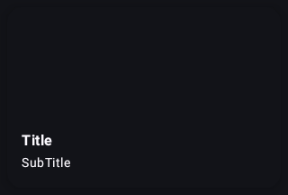
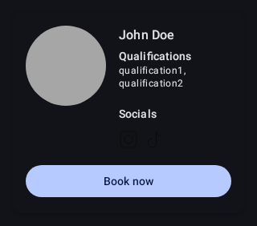
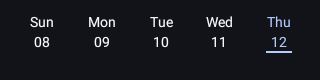
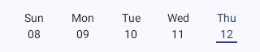
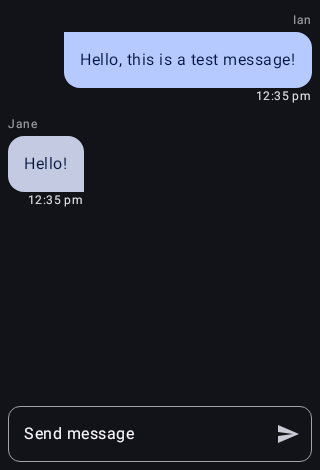
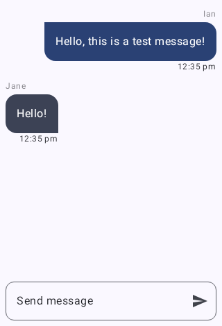

# Gym Planner Mobile App

**Gym Planner** is a Kotlin Multiplatform project that provides end users with the ability to:

- Create personal training bookings
- View upcoming fitness classes organized by the gym
- Chat with a member of staff (**under development**)

This app leverages the power of Kotlin Multiplatform to provide a consistent experience across platforms while delivering essential gym management features.

---

## Technologies Used

- **Kotlin**: A modern, expressive, and concise language that works across multiple platforms.
- **Coroutines**: For asynchronous programming, allowing efficient background task management with structured concurrency.
- **Ktor**: A lightweight framework for building RESTful APIs, used for network communication in the KMP module.
- **Compose**: A declarative UI framework for building native user interfaces with Kotlin.
- **MockK**: A Kotlin-first mocking library used for unit testing and mocking dependencies.
- **Roborazzi**: A JVM-based screenshot testing library used to validate and ensure the consistent appearance of the app's UI across different versions and environments.
- **Dagger**: Dagger helps manage dependencies in a project by automating the process of creating and injecting objects, promoting a clean and decoupled architecture. It is primarily used in the Android module of the project, where it integrates with Hilt—an official Android DI library built on top of Dagger—for simplified setup and improved usability.
- **Koin**: A lightweight, intuitive dependency injection framework for Kotlin, designed with simplicity and ease of use in mind. Koin is primarily utilized in the Kotlin Multiplatform (KMP) module, offering a flexible and concise way to manage dependencies across multiple platforms with minimal configuration.

---

## Features

- **Personal Training Booking**: Allows users to check availability and book personal trainers.
- **Fitness Classes Schedule**: View upcoming fitness classes organized by the gym.
- **Live Chat**: Communicate with a gym staff member for support (**under development**).

---

## Services

This app integrates with a backend **RESTful service** that handles various gym operations, such as:

- Booking management
- Fitness class schedules
- Chat functionality (under development)

The backend is maintained in the [GymPlannerService repository](https://github.com/IanArb/GymPlannerService).

---

## Getting Started

### Prerequisites

To run the backend service locally, you need:

1. **ngrok Account**: Create an account with [ngrok](https://ngrok.com/). Ngrok allows you to expose your local backend service to the public internet.

2. **Spring Boot Backend**: Run the backend Spring Boot project locally on port `8080`.

   ```bash
   ./gradlew bootRun
   ```

3. Expose the Backend with ngrok: In a separate terminal window, run ngrok to expose your backend service publicly.

```bash
ngrok http 8080
```

Ngrok will provide a public URL, for example:

```bash
https://abcd1234.ngrok.io
```

4. Expose the WebSocket endpoint: The WebSocket URL will typically be the same as the HTTP URL but with the `wss://` protocol.

```bash
ngrok http 8000
```

5. Use this public URL in the `androidApp/build.gradle.kts` file. Update the `buildConfigField` for `BASE_URL` with your ngrok HTTP URL, and create a corresponding `WEBSOCKET_URL` with the WebSocket protocol (`wss://`).

   For example, if your ngrok URL is `https://abcd1234.ngrok-free.app`, you would update the file as follows:

    ```kotlin
    // androidApp/build.gradle.kts
    android {
        defaultConfig {
            // ...
            buildConfigField("String", "BASE_URL", "\"https://your-ngrok-url\"")
            buildConfigField("String", "WEBSOCKET_URL", "\"wss://your-ngrok-url\"")
        }
        // ...
    }
    ```

## Screenshots

### Dashboard
The main dashboard displays gym classes carousel and quick access to book personal trainers.

<table>
  <tr>
    <td></td>
    <td></td>
  </tr>
  <tr>
    <td align="center">Dashboard - Dark Mode</td>
    <td align="center">Dashboard - Light Mode</td>
  </tr>
</table>

### Gym Locations
Browse and select from available gym locations.

<table>
  <tr>
    <td></td>
    <td></td>
  </tr>
  <tr>
    <td align="center">Gym Locations - Dark Mode</td>
    <td align="center">Gym Locations - Light Mode</td>
  </tr>
</table>

### Personal Trainers
View available personal trainers and their profiles.

<table>
  <tr>
    <td></td>
    <td></td>
  </tr>
  <tr>
    <td align="center">Personal Trainers - Dark Mode</td>
    <td align="center">Personal Trainers - Light Mode</td>
  </tr>
</table>

### Booking & Availability
Check trainer availability and book time slots through an interactive calendar interface.

<table>
  <tr>
    <td></td>
    <td></td>
  </tr>
  <tr>
    <td align="center">Booking Calendar - Dark Mode</td>
    <td align="center">Booking Calendar - Light Mode</td>
  </tr>
  <tr>
    <td></td>
    <td></td>
  </tr>
  <tr>
    <td align="center">Time Slots - Dark Mode</td>
    <td align="center">Time Slots - Light Mode</td>
  </tr>
</table>

### Chat
Real-time chat interface for communicating with gym staff.

<table>
  <tr>
    <td></td>
    <td></td>
  </tr>
  <tr>
    <td align="center">Chat Interface - Dark Mode</td>
    <td align="center">Chat Interface - Light Mode</td>
  </tr>
</table>

---

## iOS Framework Distribution

This project supports distributing the shared Kotlin code as an XCFramework for iOS via Swift Package Manager.

### For iOS Developers

To integrate the shared module into your iOS project, see the [Swift Package documentation](shared/SWIFT_PACKAGE.md).

**Quick start:**

```swift
// Add to your Package.swift
dependencies: [
    .package(url: "https://github.com/IanArb/GymPlanner", from: "1.0.0")
]
```

### Automated Versioning & Releases

This project uses [semantic-release](https://semantic-release.gitbook.io/) for automated version management and releases.

**How it works:**
- Commits following [Conventional Commits](https://www.conventionalcommits.org/) format automatically trigger releases
- Version numbers are determined by commit types (`feat`, `fix`, `BREAKING CHANGE`)
- CHANGELOG.md is automatically generated
- XCFramework is built and published to GitHub Releases
- Swift Package Manager manifest is updated with checksums

**Commit message format:**
```bash
feat(scope): add new feature       # Minor release (0.1.0)
fix(scope): fix bug                # Patch release (0.0.1)
feat!: breaking change             # Major release (1.0.0)
```

See [CONTRIBUTING.md](CONTRIBUTING.md) for detailed commit message guidelines.

### Building the XCFramework

The XCFramework is automatically built and published when commits are pushed to `main`:

```bash
# Make changes following conventional commits
git commit -m "feat(ios): add new authentication method"
git push origin main
```

The GitHub Actions workflow will:
- Analyze commits and determine next version
- Generate CHANGELOG.md
- Build the XCFramework for all iOS targets (device + simulator)
- Create a GitHub release with artifacts
- Update version files

To build locally:

```bash
./build-xcframework.sh 1.0.0
```

The XCFramework will be available at: `shared/build/XCFrameworks/release/SharedGymPlanner.xcframework`

---

## Contributing

We welcome contributions to improve the app! Please read [CONTRIBUTING.md](CONTRIBUTING.md) for:
- Commit message guidelines (Conventional Commits)
- Development workflow
- Release process
- Code style guidelines

### Quick Contribution Guide

1. Fork the repository
2. Create a feature branch: `git checkout -b feat/my-feature`
3. Make changes and commit using conventional format: `git commit -m "feat: add amazing feature"`
4. Push to your fork: `git push origin feat/my-feature`
5. Create a Pull Request

---

## License
This project is licensed under the MIT License.
